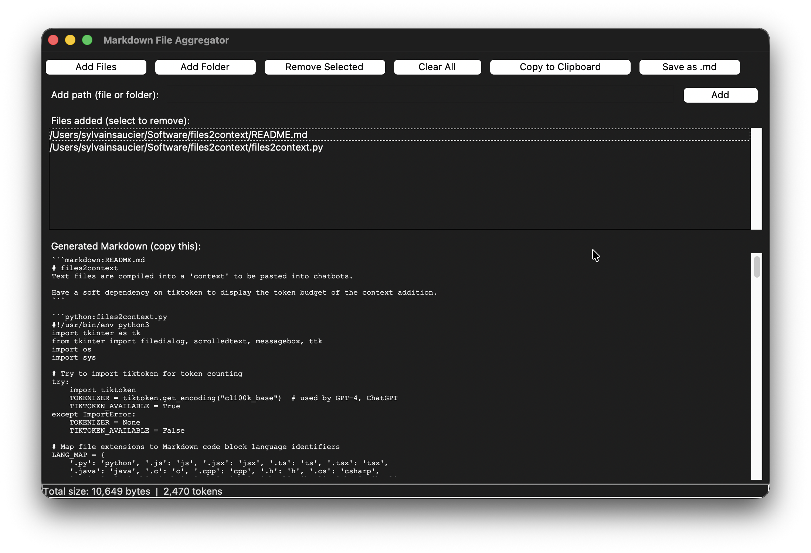

# files2context

A GUI tool that compiles text files into a single Markdown-formatted context, ready for pasting into chatbots, LLM prompts, or documentation.

 <!-- optional -->

---

## Features

- **Add files or entire folders** recursively (ignores dotfiles and dotfolders by default).
- **Custom file/folder entry** – paste or type a path directly.
- **Markdown code blocks** – each file is wrapped in a fenced code block with:
  - The file’s relative path (from the common base folder) as the info string.
  - Syntax highlighting hints based on file extension (e.g., `.py` → `python`).
- **Token counting** – optionally shows token budget (using `tiktoken`’s `cl100k_base` encoding, used by GPT‑4/ChatGPT).
- **Copy to clipboard** – one‑click copy of the generated Markdown.
- **Save as `.md`** – export to a file.
- **Manage file list** – remove individual entries or clear all.
- **Status bar** – displays total byte size and token count (if `tiktoken` is installed).

---

## Installation

Clone the repository and run the script directly (requires Python 3.6+).

```bash
git clone https://github.com/yourusername/files2context.git
cd files2context
python files2context.py
```

To install it as a command line utility in unix-like systems, 

```bash
sudo cp files2context.py /usr/local/bin/files2context
```

